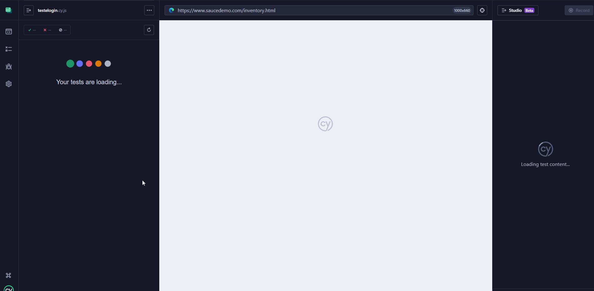
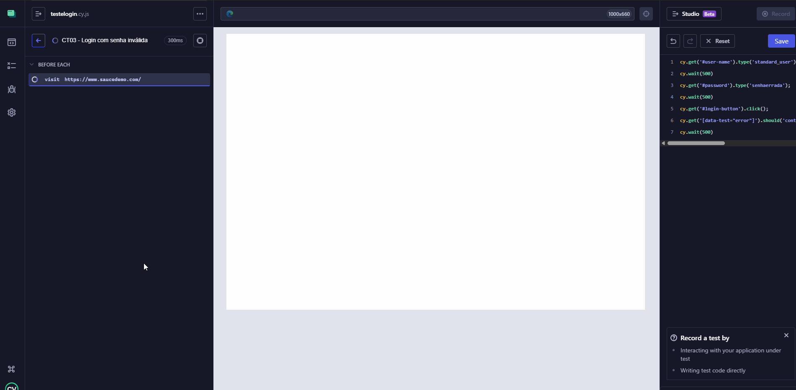
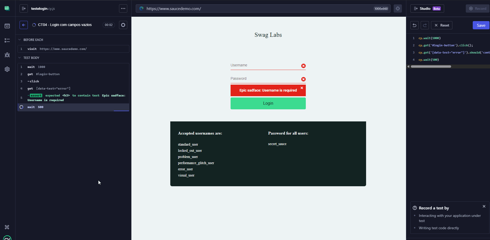
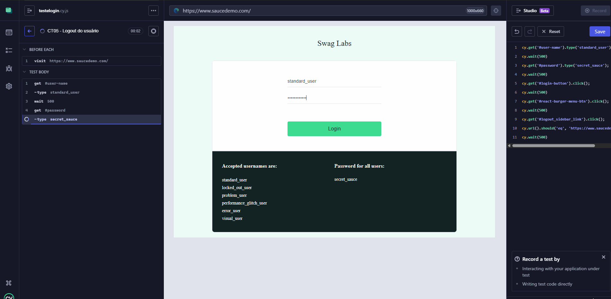

# Casos de Teste Detalhados - Projeto 1: Login

## CT01 - Login com usuário e senha válidos
**Descrição:** Testar se um usuário válido consegue acessar a aplicação com sucesso  
**Pré-condições:** Conta de teste criada (standard_user / secret_sauce)  
**Passos:**  
1. Acessar [Sauce Demo](https://www.saucedemo.com/)  
2. Inserir usuário: standard_user  
3. Inserir senha: secret_sauce  
4. Clicar em "Login"  

**Resultado Esperado:** Usuário é redirecionado para a página de produtos  
**Resultado Real:** 

---

## CT02 - Login com usuário inválido
**Descrição:** Testar se a aplicação exibe mensagem de erro ao inserir usuário incorreto  
**Pré-condições:** Nenhuma  
**Passos:**  
1. Acessar [Sauce Demo](https://www.saucedemo.com/)  
2. Inserir usuário inválido: usuarioerrado  
3. Inserir senha válida: secret_sauce  
4. Clicar em "Login"  

**Resultado Esperado:** Aparece mensagem de erro "Epic sadface: Username and password do not match any user in this service"  
**Resultado Real:** 

---

## CT03 - Login com senha inválida
**Descrição:** Testar se a aplicação exibe mensagem de erro ao inserir senha incorreta  
**Pré-condições:** Nenhuma  
**Passos:**  
1. Acessar [Sauce Demo](https://www.saucedemo.com/)  
2. Inserir usuário válido: standard_user  
3. Inserir senha inválida: senhaerrada  
4. Clicar em "Login"  

**Resultado Esperado:** Aparece mensagem de erro "Epic sadface: Username and password do not match any user in this service"  
**Resultado Real:** 

-- 

## CT04 - Login com campos vazios
**Descrição:** Testar se a aplicação exibe mensagem de erro ao tentar logar sem preencher usuário ou senha  
**Pré-condições:** Nenhuma  
**Passos:**  
1. Acessar [Sauce Demo](https://www.saucedemo.com/)  
2. Não preencher o campo usuário  
3. Não preencher o campo senha  
4. Clicar em "Login"  

**Resultado Esperado:** Aparece mensagem de erro "Epic sadface: Username is required"  
**Resultado Real:** 

--

## CT05 - Logout do usuário
**Descrição:** Testar se o usuário consegue sair do sistema corretamente  
**Pré-condições:** Usuário logado  
**Passos:**  
1. Clique no menu (botão de menu lateral)  
2. Selecionar "Logout"  

**Resultado Esperado:** Usuário é redirecionado para a página de login  
**Resultado Real:** 
